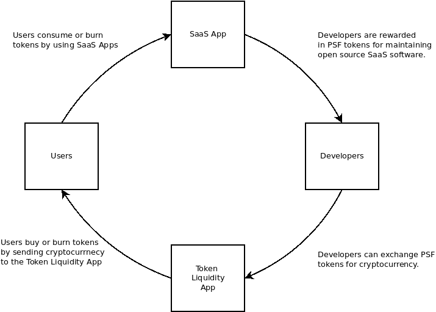

# PSF Token

The PSF token is a utility token. It has two primary purposes:

- Unlock token-only services and discounts.
- Allow members to participate in governance of the PSF organization.

## Token Services and Discounts

Much of the software infrastructure maintained by the PSF focuses on the software as a service (SaaS) business model, as that model lends itself best to the use of utility tokens. The use of SaaS software by end-users imbues the token with financial value. Many ideas are borrowed from the [Bancor whitepaper](https://github.com/Permissionless-Software-Foundation/token-liquidity/blob/master/docs/bancor-formulas/bancor-protocol-whitepaper.pdf), such as the concepts of token liquidity and forming a community that can self-fund through a local currency (token). See [this video](https://youtu.be/LcbHTF3zCdI) for additional background. The primary purpose of the token is to fund developers and other contributors, in order to maintain and improve the SaaS software produced by the Foundation.

When end-users pay for software services, the cryptocurrency they pay goes to burn tokens, and the cryptocurrency is captured in a special [token-liquidity application](https://github.com/Permissionless-Software-Foundation/token-liquidity) (inspired by the [Bancor whitepaper](https://github.com/Permissionless-Software-Foundation/token-liquidity/blob/master/docs/bancor-formulas/bancor-protocol-whitepaper.pdf)). The cryptocurrency acts as a reserve asset, backing the value of the token. The price of the token is pegged to its reserve asset through by a math equation. This also provides perfect liquidity for the PSF token, since it can always be traded for the cryptocurrency backing it. Research, development, and maintenance are funded via token-grants, by existing token holders. The token-liquidity application allows contributors to exchange their tokens for the underlying cryptocurrency.

New tokens are minted to fund developers (supply), and old tokens are taken out of circulation through the burning mechanism of users consuming services (demand). New tokens are directed by existing token holders to fund developer grants every three months. It is the responsibility of PSF token holders (participating the in the governance of the organization) to balance the circulating supply and price of the token.

## Governance

The PSF community regularly engages in voting for [proposals](https://psfoundation.cash/proposals). Voting tokens are distributed to the top 50 addresses based on _merit_. Merit is the product of token quantity and token age (in days):

> merit = token quantity x token age

Each address that holds PSF tokens has its merit calculated. 10,000 voting tokens are air-dropped to the top 50 addresses.

Merit incentivizes savings of the PSF tokens. Those who earn and hold tokens are in the best position to influence the PSF community. Those who have the most 'skin in the game' have the most control, and every member starts on a level playing field with clear rules.

### VIP Members

PSF community members who achieve a merit score of 30,000 are allowed to speak in the [VIP Telegram channel](https://t.me/psf_vip). These are considered the 'economically significant' members of the community. The top-level committees are answerable to this group. The governance structure is expanded [in this blog post](https://psfoundation.cash/blog/healthy-bitcoin).

30,000 can be achieved in any combination of ways. Here are some examples:

- 1,000 tokens for 30 days
- 2,000 tokens for 15 days
- 10,000 tokens for 3 days
